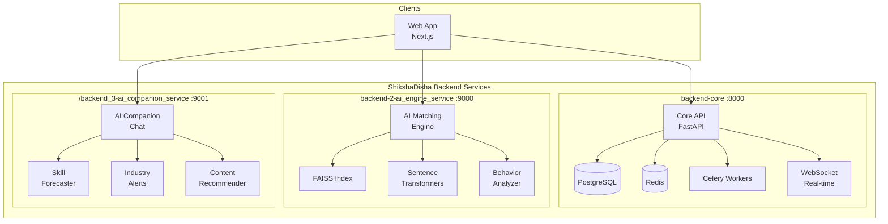

<h1 align="center">🎓 ShikshaDisha – AI-Powered NSQF-Integrated Learning Ecosystem</h1>

> <p align="center">🚨 <strong>"Design and development of an AI-powered learning path generator, Vocational Pathway Navigator with Dynamic Career Intelligence and NSQF-Integrated Learning Ecosystem"</strong></p>

<div align="center">

<a href="https://shiksha-disha.vercel.app/" target="_blank">
    
</a>


</div>

## 🔹 Context

### 🏆 Prototype for AMD Slingshot Hackathon 2026

- **Theme:** 2. AI in Education & Skilling
- **Category:** Software


## 💡 Proposed Solution

### ✨ Key Features

- **Smart Pathway Engine** – AI analyzes learner profiles to generate personalized NSQF-aligned career routes
- **AI Matching Engine** – Smart course/curriculum matching based on user's input
- **Career Journey Gamification** – Achievement unlocks, skill mastery levels, industry challenges & leaderboards
- **AI Learning Companion** – Real-time guidance, industry alerts, skill forecasts & content recommendations

### 🎯 Problem Resolution

- **Personalized NSQF Pathways** – AI matches 50+ learner parameters to 139+ government courses with 95% accuracy
- **Real-Time Market Alignment** – Dynamic integration with labor market intelligence ensures pathway recommendations adapt to industry demands, emerging skills, and regional employment opportunities
- **Multilingual Accessibility** – 12+ Indian languages with voice navigation for diverse demographics

### 🔥 Unique Value Propositions

- **Predictive Career Intelligence** – AI forecasts employment probability & salary potential with 3-5 year projections
- **Adaptive Pathway Evolution** – Routes auto-adjust based on progress, industry changes & skill demands
- **Gamified Engagement** – Duels and streaks
- **Cross-Sector Mobility** – AI identifies transferable skills enabling seamless career transitions


## 📊 Feasibility and Viability

### ✅ **Why It Works**
- **High Demand** – Diverse learner backgrounds demand tailored skilling pathways
- **Industry Alignment** – Labour market intelligence ensures relevance to evolving job roles
- **Future-Proofing** – Adaptive AI pathways enable lifelong learning and stackable skills
- **Institutional Backing** – NCVET & MSDE integration provides credibility and adoption push

### ⚠️ **Current Challenges & Risks**
- **User Trust:** Learners may hesitate to rely on AI-driven career guidance
- **Data Accuracy:** Incomplete or outdated learner and labour market data may reduce recommendation quality
- **Bias & Fairness:** Risk of unequal opportunities if algorithms favor certain demographics or regions
- **Long-Term Adoption:** Sustaining engagement as career needs evolve requires continuous system updates

### 🛡️ **Strategies to Overcome**
- **Trust Building:** Explainable AI, counselor support, and transparent recommendation logic
- **Data Quality:** Regular updates from NSQF, labour market intelligence, and verified providers
- **Fairness & Equity:** Bias audits, inclusive design, and multilingual accessibility
- **Sustained Engagement:** Adaptive pathways, career milestone tracking, and continuous upskilling prompts

## 📚 Research & References

### Key Supporting Market Facts
- **75%** of Indian learners gain career benefits from AI-driven personalized paths
- **90%** of employers prioritize NSQF-aligned micro-credentials in hiring
- India's EdTech market expected to surpass **$10B by 2025**, led by mobile-first apps
- AI-led adaptive learning speeds up skill acquisition by **30-40%** versus traditional means
- **1+ billion** Indian workers need reskilling by 2030 due to tech change and automation

### Research Validation
- **AI Personalization:** AI creates customized learning paths that boost engagement and results  
  *[[Frontiers in Education 2024](https://www.frontiersin.org/articles/10.3389/feduc.2024.1424386/full) | [Emerald AI in Education](https://www.emerald.com/insight/content/doi/10.1108/XJM-03-2022-0012/full/html)]*
- **Vocational Skilling & NSQF:** NSQF links vocational training with industry and job market demands  
  *[[ICRIER NSQF Note](https://icrier.org/pdf/ES/The_National_Skills_Qualification_Framework_in_India.pdf) | [IJFMR NSQF Implementation](https://www.ijfmr.com/papers/2024/6/34118.pdf)]*
- **Labour Market Intelligence:** Real-time labour data integration is vital for future-ready skills  
  *[[India Employer Forum 2025](https://indiaemployerforum.org/world-of-work/insights-from-teamlease-edtech-career-outlook-report-hy2-july-december-2025/) | [Economic Times EdTech](https://education.economictimes.indiatimes.com/news/higher-education/future-ready-india-how-edtech-can-develop-the-workforce/119411774)]*
- **India EdTech Growth:** EdTech is a $10B+ market growing quickly with AI-powered, mobile-first solutions  
  *[[Market Research Future](https://www.marketresearchfuture.com/reports/india-edtech-market-46222) | [HolonIQ Charts 2025](https://www.holoniq.com/edtech-in-10-charts)]*

> 💡 **Takeaway:** Research validates the importance of AI-personalized learning, NSQF compliance and scalable secure design for India's skill ecosystem.

## 📈 Success Metrics

- **Pathway Recommendation Accuracy** (Target: 95%)
- **User Engagement Rate** with AI Learning Companion
- **NSQF Course Completion Rates**
- **Employment Outcome Tracking** (6-month post-completion)
- **Multi-language Adoption Metrics**
- **Labor Market Alignment Score**
- **User Satisfaction & Trust Scores**

## 🎯 Impact on Target Audience

- **Students & Youth:** Personalized career pathways aligned with market demands
- **Job Seekers:** Data-driven career transitions with employment probability forecasts
- **Working Professionals:** Continuous upskilling with adaptive learning paths
- **Educational Institutions:** NSQF-integrated curriculum planning support
- **Government Schemes:** Enhanced effectiveness of Skill India missions through AI optimization

---

## ⚙️ Platforms

| Platform                                                       | Supported? |
| --------------------------------------------------------------- | ----------- |
| Web (any browser with JS functionality) + Fully Responsive       | ✅          |
| [Android](frontend-android/) (non-natively through WebView)                | ✅          |

## 🔧 Development


## 🚀 Getting Started

### Prerequisites

- Node.js 18+
- Python 3.11+
- Docker & Docker Compose
- PostgreSQL 15 (for local development)

### Frontend

```bash
cd frontend-web
npm install
cp .env.template .env.local
npm run dev
```

### Backend Services

See [DEPLOYMENT_FULL.md](DEPLOYMENT_FULL.md) for complete deployment instructions.

**Production mode:**
```bash
cd backend_1-core_service
docker-compose up -d
cd ../backend_2-ai_engine_service
docker-compose up -d
cd ../backend_3-ai_companion_service
docker-compose up -d
```

**Development mode** (with auto-reload on code changes):
```bash
cd backend_1-core_service
docker-compose --profile dev up -d
cd ../backend_2-ai_engine_service
docker-compose --profile dev up -d
cd ../backend_3-ai_companion_service
docker-compose --profile dev up -d
```

#### Hot Reload Development

Code changes are now mounted into containers via volumes. After making code changes:

```bash
# Rebuild and restart the service
docker-compose up -d --build
```

The `--build` flag rebuilds the image to pick up any dependency changes, while volumes mount your local code for live updates.

## 🏗️ Architecture



### Service Overview

| Service | Port | Technology | Purpose |
|---------|------|------------|---------|
| **backend-core** | 8000 | FastAPI + PostgreSQL | User management, actions, notifications, sessions, streaks |
| **backend-2-ai_engine_service** | 9000 | FastAPI + FAISS | Course matching, behavior analysis, recommendations |
| **/backend_3-ai_companion_service** | 9001 | FastAPI + Redis | AI chat, skill forecasting, alerts |

### Data Flow

1. **User Actions** → Core API → PostgreSQL + Celery Workers
2. **Course Matching** → AI Engine → FAISS Vector Search → Semantic Similarity
3. **AI Companion** → Skill Forecasts + Content Recommendations

### Tech Stack

- **Frontend:** React, Next.js 14, TypeScript, TailwindCSS, shadcn/ui
- **Backend:** Python FastAPI (3 microservices)
- **Database:** PostgreSQL 15
- **Cache/Queue:** Redis 7
- **AI/ML:** Sentence Transformers, FAISS, scikit-learn
- **Task Queue:** Celery
- **Container:** Docker, GitHub Container Registry

## 📱 Screenshots *
<table> <tr> <td><strong>Landing Page</strong><br><br>  </td> </tr> </table>


## 👥 Our AMD Slingshot Hackathon 2026 Team (DevBandits)

<div align="center">

|  #  |     Team Member      |              Role              | GitHub Profile |
| :-: | :------------------: | :----------------------------: | :-----------------------------------------------------------------------------------------------------------------------------: |
|  1  | **Fareed Ahmed Owais**    | 🎯 Team Lead    | [🔗 FareedAhmedOwais](https://github.com/FareedAhmedOwais) |
|  2 | **Abdur Rahman Qasim**    |    🔎 Research Engineer              | [🔗 Abdur-rahman-01](https://github.com/Abdur-rahman-01) |
|  3  | **Mohammed Saad Uddin**   | 🚀 Full-stack + AI/ML Developer     | [🔗 saad2134](https://github.com/saad2134) |

</div>


## 📊 **Repo Stats**

<div align="center">
  


</div>

## ⭐ Star History

<a href="https://www.star-history.com/#saad2134/shiksha-disha&Date">
 <picture>
   <source media="(prefers-color-scheme: dark)" srcset="https://api.star-history.com/svg?repos=saad2134/shiksha-disha&type=Date&theme=dark" />
   <source media="(prefers-color-scheme: light)" srcset="https://api.star-history.com/svg?repos=saad2134/shiksha-disha&type=Date" />
   
 </picture>
</a>


## ✨ Icon


## 🔰 Banner


## 📄 License

This project is licensed under the **MIT License** - see the [LICENSE](LICENSE) file for details.

- ✅ Commercial use
- ✅ Modification
- ✅ Distribution
- ✅ Private use
- ❌ Liability
- ❌ Warranty

---

## ✍️ Endnote
<p align="center">Developed with 💖 for the AMD Slingshot Hackathon 2026, with heartfelt thanks for the opportunity to build and innovate.</p>

---

## 🏷 Tags  

`#WebApp` `#SmartEducation` `#AIinEducation` `#PersonalizedLearning` `#SkillPathways` `#CareerGuidance` `#NSQFIntegration` `#VocationalEducation` `#AIPathGenerator` `#DigitalLearning` `#AdaptiveLearning` `#GamifiedLearning` `#TokenEconomy` `#AIMatching` `#SkillNavigator` `#FutureSkills` `#EdTechIndia` `#SkillForecasting` `#CareerIntelligence` `#MultilingualAI` `#AMDSlingshot2026` 


