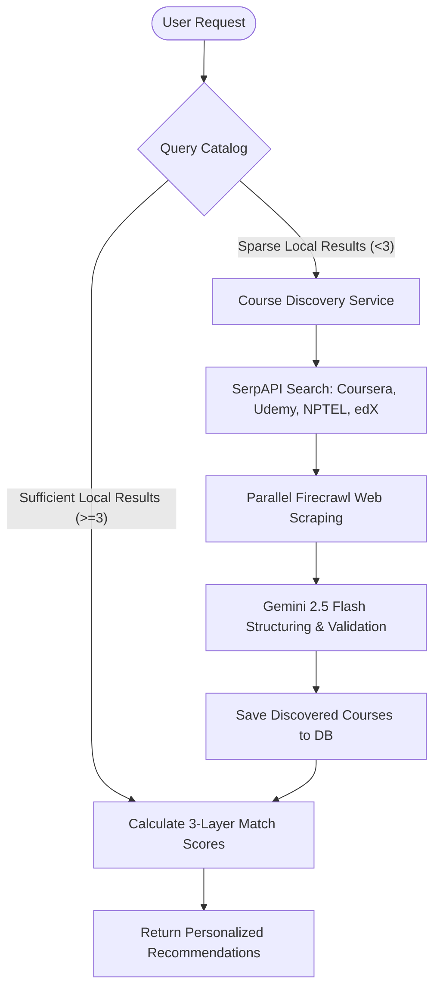

# Course Searching, Matching, and Discovery Architecture

This document describes how search, personalized matching, real-time external course discovery, and milestone study-mode overrides are architected and operate within ShikshaDisha.

---

## 1. High-Level Workflows

ShikshaDisha merges standard local catalog search with dynamic real-time web scraping to supply students with highly aligned, up-to-date recommendations.

---

## 2. Dynamic Course Discovery

When a user executes a search or asks for recommendations for a rare career target, and the local catalog yields few results (fewer than 3), the backend triggers the **CourseDiscoveryService** dynamically.

### A. Search Query Generation
The service automatically constructs target search queries limiting searches to reputable online academies:
- Coursera (`site:coursera.org`)
- Udemy (`site:udemy.com`)
- NPTEL (`site:nptel.ac.in`)
- Swayam (`site:swayam.gov.in`)
- edX (`site:edx.org`)

### B. Parallel Scraping with Timeout Fallbacks
1. The search hits Google via **SerpAPI**.
2. New URLs are filtered and scraped in parallel using **Firecrawl**.
3. To prevent slow responses or hung scraping requests from blocking the user flow, each scrape has a strict **4.0-second execution timeout**. If a scrape times out, the service falls back to structured SerpAPI snippet metadata.

### C. Gemini 2.5 Flash Parsing & Tagging
Markdown text from crawled pages or search snippets is sent to Gemini 2.5 Flash to extract metadata structured to our database schemas:
- **Title & Provider**: Normalizes titles and maps platforms (e.g., edX, NPTEL).
- **Description**: 1-3 paragraph summary of target concepts.
- **National Skills Qualifications Framework (NSQF) Alignment**: Detects and aligns qualification levels (3-8) and sectors (e.g., "IT-ITeS", "Electronics").
- **VARK Scoring**: Assigns numeric weights (Visual, Auditory, Read/Write, Kinesthetic) that sum to exactly `1.0`.
- **Syllabus & Math**: Generates week-by-week syllabus breakdowns, math depth complexity (1 to 3), and list of required math prerequisites.

---

## 3. The 3-Layer Matching Engine

All courses—both local and dynamically discovered—are passed through the backend `MatchingService` to calculate a personalized `MatchReport` against the user's `LearnerProfile`.

### Layer 1: Hard Filters (Exclusion)
Filters out courses that don't match critical compatibility criteria:
- **Language**: Excludes courses in unsupported/unpreferred languages.
- **Difficulty**: Limits choices to allowed difficulty levels.
- **Math Depth**: If a course's math depth exceeds the user's comfort by 2+ levels, it is excluded.
- **Time Commitment**: If weekly required study hours exceed the user's available time by 2.5x, it is excluded.

### Layer 2: Weighted Rule-Based Scoring
For all valid courses, a score out of 100% is computed based on these weights:

| Dimension | Weight | Description / Calculation |
| :--- | :--- | :--- |
| **VARK Profile Alignment** | **30%** | Cosine similarity between user's VARK scores and course's VARK scores |
| **Learning Style Fit** | **20%** | Jaccard similarity coefficient of user style preferences vs course tags |
| **Time Fit** | **20%** | Fit percentage based on hours available per week relative to course duration |
| **NSQF Alignment** | **15%** | Priority bonus if the course matches the user's targeted qualification goals |
| **Quality Signals** | **15%** | Score calculated using average rating normalized by log-scaled reviews count |

### Layer 3: FAISS Reranking (Active at 50+ user enrollments)
Performs semantic vector searches on user-stated goals and topic queries using the local FAISS index, boosting collaborative completions.

---

## 4. Milestone Overrides & Study Modes

When visualizing the learning journey on the **My Career Map** page (`/student/career_map`), students can customize how they plan to cover each milestone.

- **Study Modes**:
  - **Standard**: Standard online learning sequence via the enrolled platform.
  - **Already Studied**: Marks the milestone as completed immediately, setting progress to `100%`.
  - **Learned Off Platform**: Marks the milestone as completed immediately, setting progress to `100%`.
- **Persistent Overrides**:
  - For active enrolled courses, overrides are saved directly on the `Enrolment.study_mode` column.
  - For non-enrolled career template stages (e.g. internships, specialized modules), overrides are persisted in the `milestone_overrides` database table.
  - Updating a milestone's study mode automatically marks the cached career map snapshot as stale, forcing it to reload the learning timeline.
